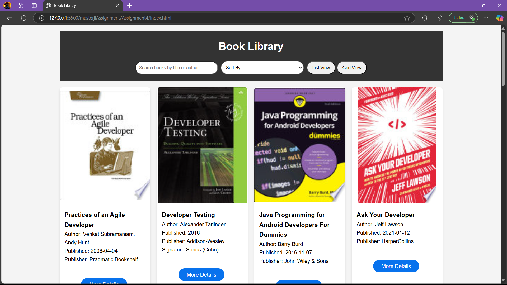
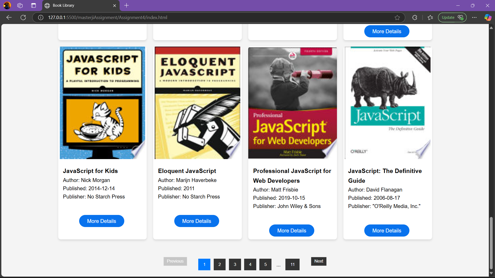
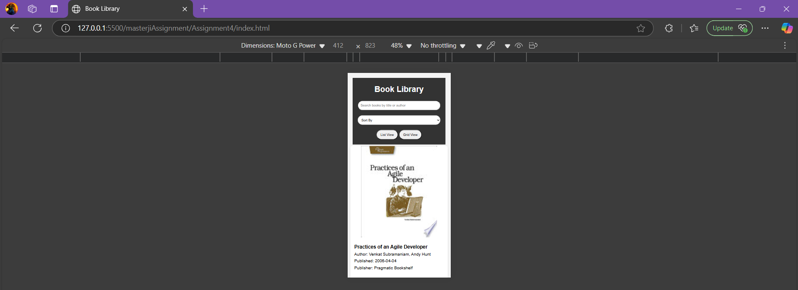
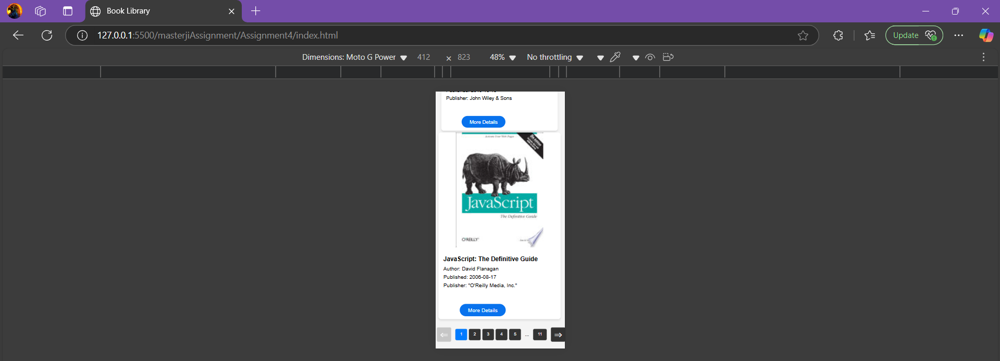

# Book Library Web Application

## Overview
This Book Library application is a dynamic web platform that fetches and displays book data using the FreeAPI.app Books API. The application provides an interactive and user-friendly interface to browse, search, and explore books.

## Features
- Fetch books dynamically from the API
- Switch between list and grid view
- Search books by title or author
- Sort books by title (A-Z, Z-A) and publication date
- Pagination support
- Responsive design for mobile and desktop
- Direct link to book details

## Technologies Used
- HTML5
- CSS3
- Vanilla JavaScript
- FreeAPI.app Books API

## Screenshots
**Desktop View**

**Mobile View**

## Setup and Installation
1. Clone the repository
2. Open `index.html` in your web browser
3. No additional setup required

## Deployment
- Hosted on: Vercel
- Live Demo: [Live Demo URL](https://cohort-code.vercel.app/masterjiAssignment/Assignment4/index.html)

## API Used
- Endpoint: https://api.freeapi.app/api/v1/public/books
- Documentation: https://freeapi.hashnode.space/api-guide/apireference/getBooks

##### Most of the part in readme is written using AI because I don't know how to write a readme in descriptive manner. 